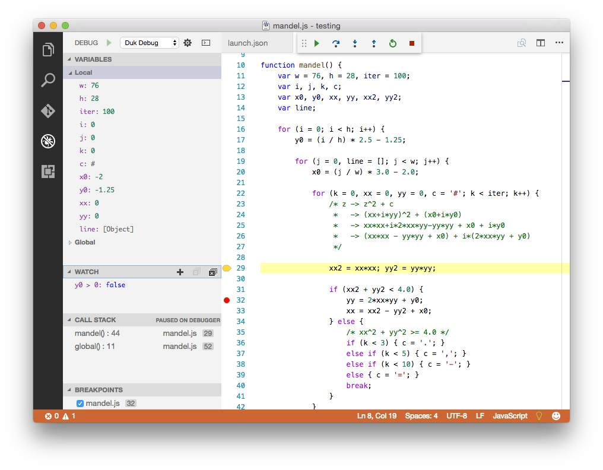

# VSCode Debug Adapter for Duktape

## Description
A debug adapter for Visual Studio Code written in Typescript targeting [Duktape](https://github.com/svaarala/duktape) version 1.5 runtimes. It implements the VS Code Debug Protocol (or CDP),

See:
 - [https://code.visualstudio.com/docs/extensions/overview](https://code.visualstudio.com/docs/extensions/overview)
 - [https://code.visualstudio.com/docs/extensions/example-debuggers](https://code.visualstudio.com/docs/extensions/example-debuggers)

The adapter uses the protocol of version 1.50 of [debugger.rst](https://github.com/svaarala/duktape/blob/master/doc/debugger.rst).

## Status
In progress.

## Acknowledgements
This adapter is based on [original work by Harold Brenes](https://github.com/harold-b/musashi-vscode-deubgger), which has then been stripped of all the cool stuff in order to work with unmodified Duktape 1.5.
[Duktape](https://github.com/svaarala/duktape) is a JavaScript engine developed by Sami Vaarala.  It is a model of good design, coding, and documentation.

## License
[MIT](https://github.com/kurash/vscode-duktape-adapter/LICENSE)